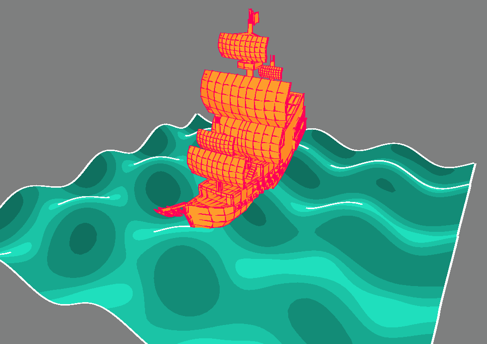
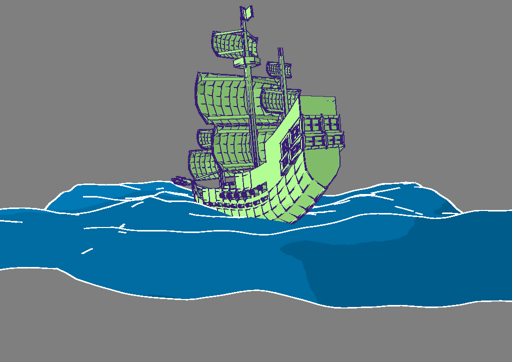

# Ocean Waves Generator Tool by Shem Skillman

This is a tool that uses OpenGL and 2 shader techniques to generate ocean waves and an animated ship. 

## Environments used to test and write the code

IDE: Microsoft Visual Studio Community 2019 Version 16.11.3

OS : Microsoft Windows 10

## Features

 * Ocean waves are generated using a wave vertex animation shader for a regular pattern of waves or alternatively a noise shader that generates waves at random using perlin noise.
* Both shaders apply silhouette lines to all the indentifiable edges in the scene on top of a toon filter.
 * A ship which can be animated to 'react' to the waves by configuring its movement and position parameters. 
 * Ship movements include bobbing up and down and twisting left/right/up/down to mimic a boat floating on choppy waters.
 * Configurable light, ship, and wave settings on the console UI make the scene highly customizable.

## How to use

To start the tool open "Ocean Waves Generator Tool.exe" in the project folder.

Once the tool has been opened, use WASD or arrow key controls to move the orbital camera around to view the scene at different angles.

There is a console that can be opened by pressing the arrow button and then expanded by dragging the bottom right drag handle. 

Try playing around with the settings to create a calm or stormy ocean scene.

Light settings:

 * Light intensity - how bright should the light be?
 * Cartoon levels - defines the number of shades of colour each coloured object can have.
 * Light X, Y, Z position - where is the point light positioned in the scene?

 Wave settings:

 * Wave frequency - should more waves be generated smaller and closer together (high frequency) or should they be larger and further apart (low frequency)?
 * Wave move speed - how fast the waves are moving.
 * Wave height - how tall should the waves be?
 * Use noise - should the waves be generated randomly using perlin noise?
 * Wave color - colour of the ocean waves.
 * Wave line color - colour of the silhouette lines on the waves.
 * Wave line thickness - thickness of the silhouette lines on the waves.

 Ship settings:

  * Move speed - how fast should the ship move in reaction to the waves?
  * Starting Y rotation - the direction in which the ship is pointing.
  * Max X, Y, Z rotation - at what extent can the ship rotate in these axes during animation?
  * Invert X, Y, Z rotation - changes the timing of the rotation animations.
  * Ship Y position - how high the ship is positioned.
  * Bob height - how much should the ship be able to bob up and down?
  * Invert bob - changes the timing of the bob animation.
  * Ship color - the paint job of the ship.
  * Ship line color - color of the silhouette lines on the ship.
  * Ship line thickness - thickness of the silhouette lines on the ship.

## Code Walkthrough

[GitHub Repository Link](https://github.com/ShemSkillman/COMP3015-Optimized-Developer-Tool)

[Developer Walkthrough Video Link](https://youtu.be/vQPV0KZxXwI)

### Overview

To begin with, the ship model and ocean plane are loaded into the scene and the noise texture is generated. 

All the information collected from the console each frame is stored inside the UI Manager class which can then accessed by the scene to perform matrix manipulation and to change uniforms in the shaders. Majority of matrix manipulation is altering the rotation and position of the ship using cos and sin to perform smooth looping animations. The values sent to the shaders on the other hand determine how waves are generated and the visual look in terms of lighting and colour.

Although the noise map is generated on startup, changing the wave frequency whilst noise is enabled requires a new noise map to be generated so that the new frequency value is used.

There are three shader programs used: a wave animation shader that uses noise, another wave animation shader that doesn't use noise, and a basic shader that does not produce waves. All these shader programs apply silhouette lines and a toon effect so they share the same fragment and geometry shaders.

For an in depth explaination on how the sihlouette lines are processed for rendering, please watch the developer walkthrough video.

### Regular Wave Animation Program

The 'waveProg' program is used to manipulate the vertices of the plane to produce waves of a consistent pattern.

In the wave animation vertex shader, the frequency determines how wide each wave is so that we can calculate how high a particular vertex needs to be positioned. A sin function is used to create the peaks and troughs in both the x and z directions. Since the pattern is consistent, the cos function is also used to calculate the normal of the wave slope.

The manipulated normal and vertex information is then passed on down the pipeline as normal so that silhouette lines can be applied. 

### Noise Wave Animation Program

The 'waveNoiseProg' is slightly different to 'waveProg' because the compiled noise vertex shader uses noise values from a noise map rather than using sin values.

In the scene, a noise map is generated in the form of a texture, and this texture is accessible from the noise vertex shader. The noise value for a particular vertex can be extracted and used to determine the height of the wave at this point. These noise values ensure that the waves generated are random in nature and do not follow a consistent pattern.

Although, it is worth mentioning that the noise texture is limited in size so the noise map will have to repeat itself eventually. The noise map will need to be regenerated when the frequency is changed.

The normals are also calculated slightly differently to use completely random noise values. This gives a 'warped' effect to mimic the refraction of light in water and it couples well with the cartoon-style look of the scene.

### Basic Program

The 'basicProg' does not use a wave animation vertex shader but it still applies the silhouette lines similar to the other 2 shader programs. This is used when rendering the ship.

## Background

What makes the tool special is the combination of wave generation with silhouette lines rendering. The silhouette lines shows the profile of waves in a stylized way to give the scene a cartoony look. On top of this, the user can change the ship movement/position, wave characteristics, and render properties to create potentially hundreds of different scenes.

I started with the provided project template and all external resources used are listed below.

## External Resources

SHIP.obj in the media folder was downloaded from [GrabCad](https://grabcad.com/library/low-poly-ship-1).

I am using the [imgui library](https://github.com/ocornut/imgui) v 1.86 to render UI.

Online Help:
 - I used the [LearnOpenGL camera guide](https://learnopengl.com/Getting-started/Camera) to implement the orbital camera for looking around the scene.
 - This [StackOverflow solution](https://stackoverflow.com/questions/30397320/opengl-water-waves-with-noise) helped me to animate the noise waves.
 - The imgui library was imported into the project with the help of this [YouTube tutorial](https://www.youtube.com/watch?v=S6ueaaN-Z2w).